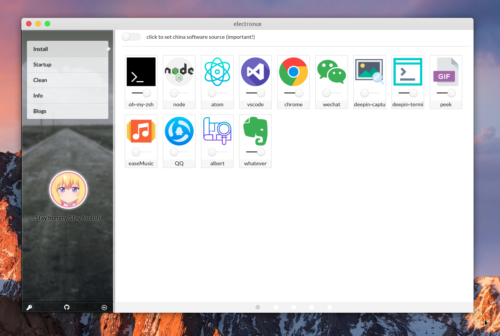
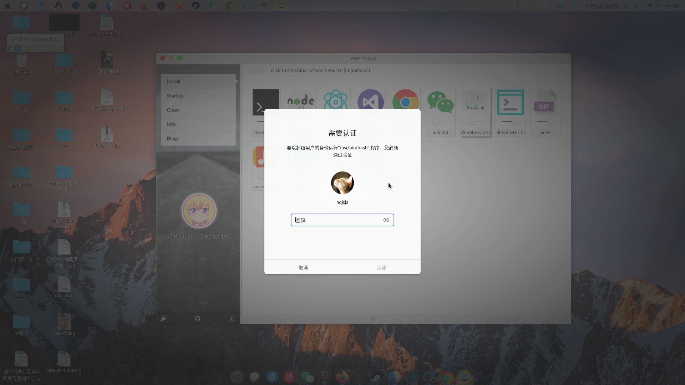
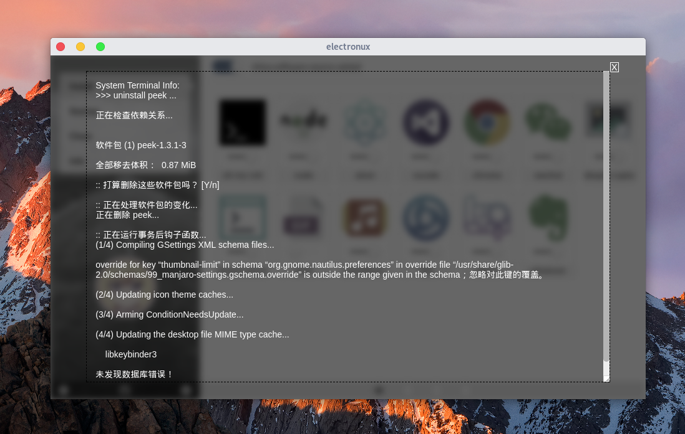
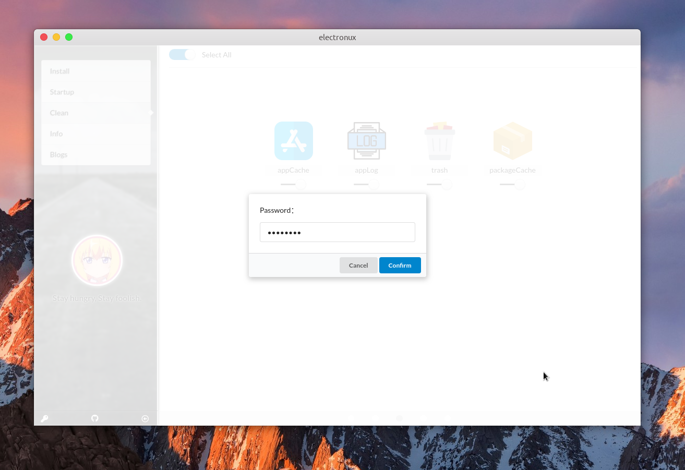
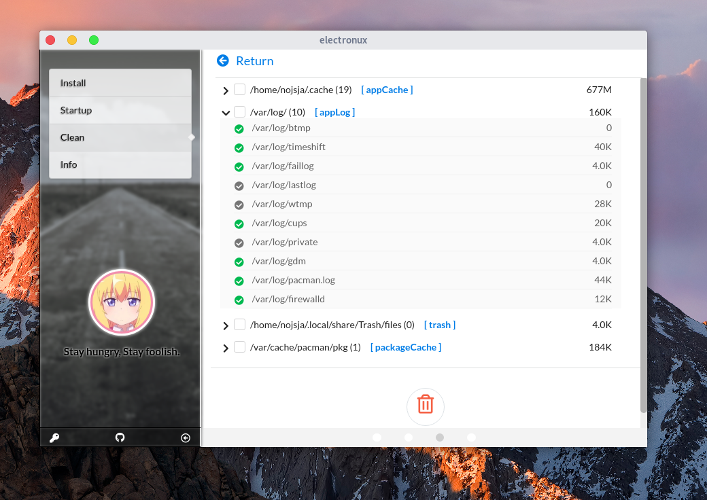
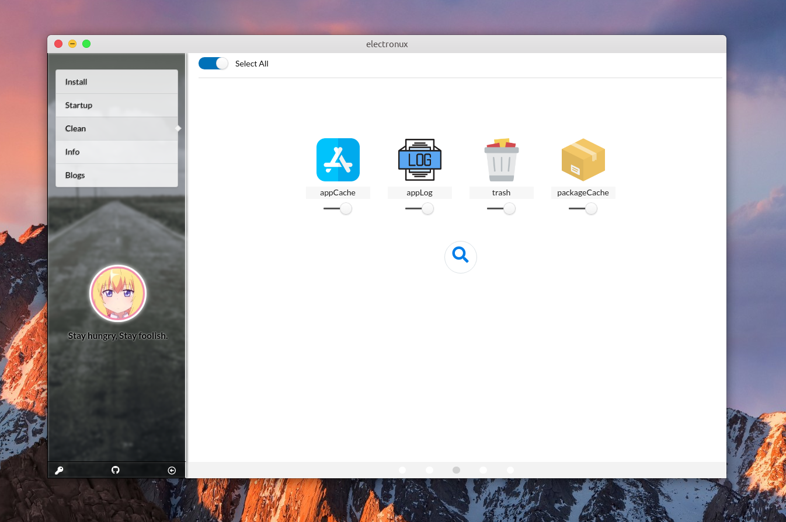
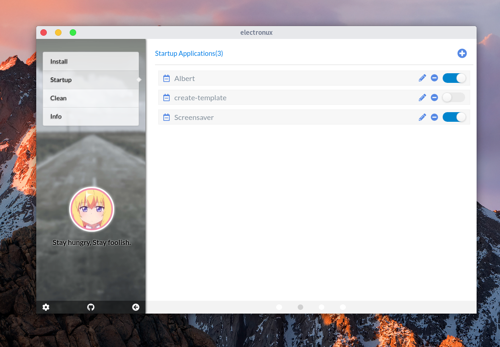
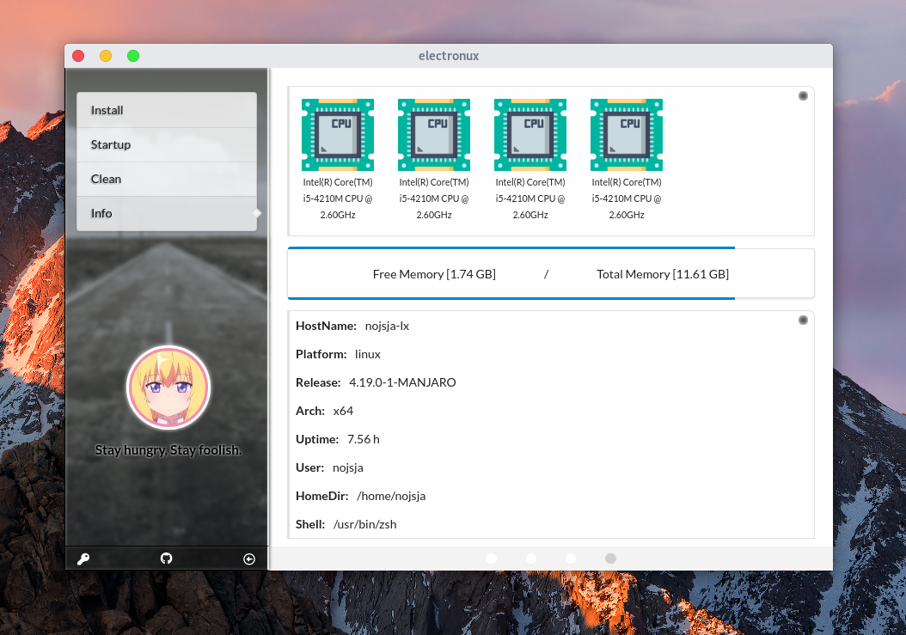
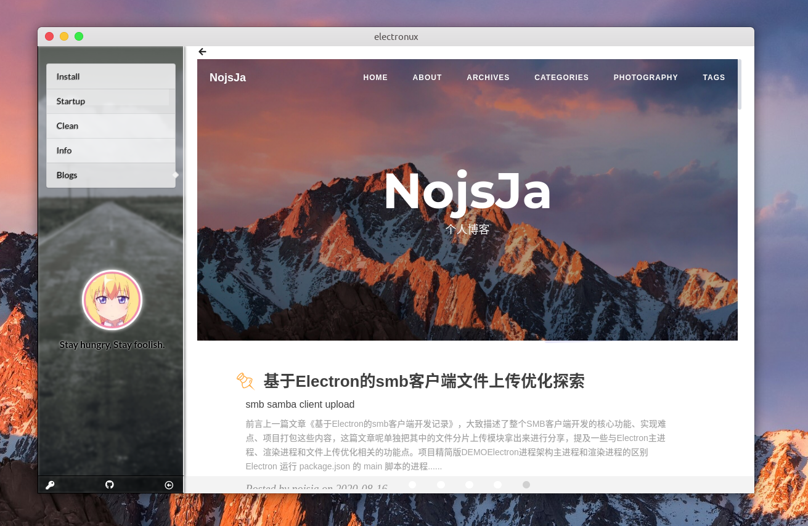

### electronux
--------------
Build for Ubuntu20.04 desktop -- [ startup configure | software installer | system cleaner | check running state ]. Powered by Electron v3, React v16, Node v8, Mobx v4, Webpack v4, shell scripts.

#### env prepare
1. 环境安装  
>切换镜像源让Electron安装更快
```sh
$: npm config set electron_mirror http://npm.taobao.org/mirrors/electron/
$: npm config set electron_custom_dir "8.2.0"
$: npm install
$: npm install electron@8.2.0 -g
$: npm install cross-env -g
```

#### commands
* 【npm run start】 -- start webpack-dev-server and electron together(only show electron log info).
* 【npm run start-dll】 -- dll the static library with webpack.
* 【npm run start-dev】 -- start webpack-dev-server.
* 【npm run start-electron】 -- start electron main process(GUI) and load localhost:3000 (http).
* 【npm run start-production】 -- start electron main process(GUI) and load dist resources (local).
* 【npm run dist】 -- compile and package the frontend resources.
* 【npm run build-before】 -- the pre steps before build application.
* 【npm run build-after】 -- the next steps after build application.
* 【npm run build】 -- build application using dist resources.
* 【npm run build-all】 -- build application after run `npm run dist`.
* 【npm publish】 -- publish to github.

#### screenshots
----------------



















